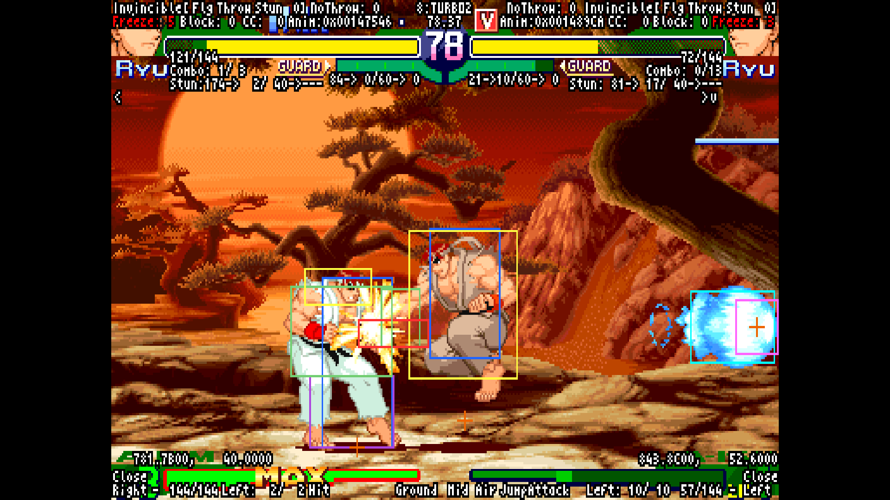

sfa3_support v1.0 
 
【はじめに】 
本スクリプトはStreet Fighter ZERO3(ALPHA3)の判定等の内部データを表示する機能を搭載しています。 
スクリプトを作るにあたって、有益な情報を発信しておられた下記の方たちにお礼を申し上げます。 
 
・mauzus様、dammit9x様、並びにmame-rrとfba-rrと様々なluaスクリプト開発に関わった方々 
　これらの方々の功績により全てが始まったと言っても過言では有りません。 
　https://code.google.com/archive/p/mame-rr/ 
　https://code.google.com/archive/p/fbarr/ 
 
・jed様 
　様々な情報提供をして頂きました。 
　https://twitter.com/mountainmanjed 
 
・各エミュレータ開発者様 
　luaengineの機能により、様々なことが実現出来ました。 
 
・さらだ様 
　開発中バージョンにおける様々な検証や、アイデア提供を行っていただきました。 
 
・全てのZERO3プレイヤー様 
　日々提供される攻略情報等、非常に役立ちました。 
 
 
【使い方】 
・エミュレータ本体と同じフォルダにsfa3_support.luaとsubフォルダを置き、sfa3_support.luaを読み込ませる。 
　MAMEの場合は起動時のオプションに「-autoboot_script」を使うことで読み込める。 
　例：mame64.exe sfz3jr2 -rompath "C:\SF30thROM" -autoboot_script "sfa3_support.lua" 
・CPS2版の場合はキーボードのShiftを推しながらEnterを押すことで拡張機能メニューのオンオフが出来る。 
　拡張機能はキーボードの上下左右を操作することによって設定を変更することが出来る。 
　拡張機能の一部の機能はエミュレータの仕様によって利用可否に差がある。ちなみにMAMEは全ての機能を利用可能。 
 
 
【動作確認環境】 
・MAME[mame0200b_64bit] 
　https://www.mamedev.org/ 
　CPS2版、PS版、GBA版で利用可能。 
　 
　 
　 
 
・MAME Rerecording[mame-rr-0139-test2] 
　https://code.google.com/archive/p/mame-rr/ 
　CPS2版で利用可能。 
　 
 
・FinalBurn Alpha Rerecording[fba-rr-v007] 
　https://code.google.com/archive/p/fbarr/ 
　CPS2版で利用可能。 
　 
 
・FightCade2[FBNeo v0.2.97.44-30] 
　https://www.fightcade.com/ 
　CPS2版で利用可能。 
　 
 
・Bizhawk[BizHawk-2.4.2] 
　http://tasvideos.org/BizHawk.html 
　SS版、PS版、GBA版で利用可能。 
　 
　 
　 
 
・PSXjin[psxjinv2.0.2] 
　https://www.emutopia.com/index.php/emulators/item/299-sony-playstation/423-psxjin 
　PS版で利用可能。 
　 
 
・VBA-ReRecording[vba-rerecording-svn480-win32] 
　https://code.google.com/archive/p/vba-rerecording/ 
　GBA版で利用可能。 
　 
 
・PCSX2-RR[PCSX2-rr_v1.0.1] 
　https://github.com/xTVaser/pcsx2-rr 
　PS2版で利用可能。 
　 
 
 
【その他設定】 
・config.luaのcにて描画遅延設定や描画色の指定等を変更することが出来る。 
・program.luaのcheatにて、STATIC CHEATの設定を追加、変更することが出来る。 
 
 
【既知の不具合や仕様】 
・エミュレータによっては映像に対して表示される判定や値が同期されないことがある。 
　推奨エミュレータはMAME。次いでMAME-RR。MAMEはデータの取得タイミングも最適化されている模様。 
・MAME使用時に文字の幅がずれたり、画面端付近のデータ等が画面内に無理やり表示されたりする。 
　これはフォントにプロポーショナルフォントが使用されていたり、エミュレータの仕様によるもの。 
・Bizhawk＋SS版の環境にて、キャラIDの値が大きいキャラ(例：ユーニ)の攻撃判定が表示されない。また、動作が非常に重い。 
・一部のエミュレータや環境によっては投げ判定が表示されない。理由は技術的な問題やエミュレータの仕様など様々。 
　投げ判定を表示させるには複雑な処理が必要なため、特定の条件や設定を行わなければならず、敷居が高い。 
　とにかく表示させたいという場合はMAMEかMAME-RRにて980904の使用が簡単でおすすめ。 
　980904はROMの作りが他と若干異なっており、表示が簡単な構造になっているため。 
　解析者向け情報として、config.luaのcにてclear_idがtrueの場合、メモリの一部を書き換えて間借りすることによって 
　投げ判定表示を実現している。MAMEを使い、clear_idをfalse、debug_coopをtrueにした上で「-debug」を有効にすると 
　メモリの書き換え無しに投げ判定表示が可能となる。 
　他にも様々な方法で投げ判定を表示させる手法を組み込んであるため、要望があれば詳しく解説するかもしれません。 
・動作時にMAMEをリセットするとスクリプトも再度読み込まれ、スクリプトが多重に起動され動作が重くなる 
・etc...思い出したりしたら追記していきます。 
 
 
【表示内容】 
　 
・HITBOX関連 
　橙:キャラクターや飛び道具等が存在する座標の中心点を表示。 
　青:存在判定。押し合い判定とも呼ばれる。キャラ同士が同じ座標に重ならないようにするための判定。 
　黄:頭部喰らい判定。3つある喰らい判定のうち、頭部に割り当てられる事が多い。のけぞり方(上のけぞり)に影響する特殊な判定。 
　緑:胴部喰らい判定。3つある喰らい判定のうち、胴部に割り当てられる事が多い。 
　紫:脚部喰らい判定。3つある喰らい判定のうち、脚部に割り当てられる事が多い。 
　赤:攻撃判定。この判定が相手の喰らい判定に接触するとヒットとなる。 
　白:投げ判定。この判定が相手の存在判定に接触すると投げが成立する。ただし、投げは処理が特殊なため例外が沢山存在する。 
　桃:飛び道具攻撃判定。この判定が相手の喰らい判定に接触するとヒットとなる。 
　水:飛び道具喰らい判定。この判定が相手の飛び道具攻撃判定に接触すると相殺となる。 
　紅:テイクノープリズナーの攻撃判定。 
　※ZERO3には投げられ判定と呼ばれるものは存在しない。投げは存在判定といくつかの設定値を参照し、結果が決定される。 
 
・Invincible 
　左から順に無敵フラグ、投げによる無敵、ピヨりによる無敵、時限無敵を表示。 
　無敵フラグ:画面端のヒット制限発生時等に有効となる。画面端のよくある無敵化はこれが関係。 
　投げによる無敵:投げ動作中に有効となる。投げた側は赤、投げられた側は黄色で表示。投げ抜けによる無敵化はこれが関係。 
　ピヨりによる無敵:ピヨり吹き飛び時に有効となる。存在判定投げでも投げられない無敵化。 
　時限無敵:SCやOCに代表される有限の無敵時間。空中ガード後着地した瞬間にも1Fの時限無敵が設定される。 
 
・NoThrow 
　投げ不能時間を表示。 
　リバーサル時やジャンプ移行動作等、いろいろな場面で設定される。 
 
・TURBO 
　ターボ設定を表示。 
　値が大きいほどターボがかかる。0:ノーマル、6:ターボ1、8：ターボ2。 
　チートした場合、最大0x0F(2Fに1回フレームスキップ)まで高速化する。 
　直下に残りタイムと残りタイム(フレーム)を表示 
 
・Freeze 
　攻撃によるヒットストップや時間停止による行動不能時間を表示。 
 
・Block 
　連続ガード回数を表示。 
　インフレに関係。 
 
・CC 
　残りOC時間を表示。 
　CCは海外でのOCの名称であるCustomComboの略。 
 
・Anim 
　アニメーションデータへのポインタを表示。 
　ポインタの先にグラフィックポインタや攻撃判定等様々な情報へアクセスできる。解析者向け。 
 
・Vital 
　残り体力を表示。 
　左側に現在残り体力、右側にMAX値を表示。 
　現在残り体力は0～144の145段階となる。KO時は値が-1になる。 
 
・Combo 
　コンボ数を表示。 
　左に現在コンボ数、右にMAXコンボ数を表示。 
 
・Stun 
　ピヨり値関連を表示。 
　例えば174-> 2/ 40->---と表示されている場合はピヨり初期化までの時間が174フレームで 
　蓄積されたピヨり値が2、ピヨり耐久値が40となる。 
　ピヨった場合、「---」の部分に残りピヨリ時間が表示される。 
 
・Guard 
　ガードクラッシュ関連値を表示。 
　例えば21->10/60-> 0と表示されている場合はガードゲージ回復までの時間が21フレームで 
　蓄積されたガードクラッシュ値が10、ガードクラッシュ耐久値が60となる。 
　ガードクラッシュした場合、「 0」の部分に残りガードクラッシュ時間が表示される。 
　※内部的には「値の増加」によってガークラが発生するよう作られていたため、そのまま表示しています。 
 
・X,Y 
　キャラクターの座標を表示。 
　「.」の左側に10進数の整数を、「.」の右側に16進数のサブピクセル値を表示する特殊な形式を採用した。 
　サブピクセルとは整数で表されるピクセル値より更に小さい内部値のこと。 
　座標が781.7B00, 40.0000の場合、X座標は781とサブピクセル値0x7B00であり、Y座標は40ピッタリであることを示す。 
　例えば右に100.8000移動する技があった場合、500.8000の位置から100.8000移動すると 
　足し合わせて601.0000の位置に移動することになり、整数部分だけを足し合わせた結果の100+500より大きくなる。 
 
・Close 
　キャラクター同士の接触フラグを表示。 
　歩いて密着したはずなのに存在判定重複防止処理により密着出来ない場合があるが 
　このフラグを見れば実際に接触しているかどうかがわかる。 
 
・Direction 
　キャラクターの向いている方向を表示。 
 
・Corner 
　キャラクターの位置を表示。 
　<:左画面端に接触 
　-:画面端に接触していない 
　>:右画面端に接触 
 
・Power 
　残りゲージを表示。 
　左側に現在残りゲージ、右側にMAX値を表示。 
　現在残りゲージは0～144の145段階となる。 
 
・Left 
　現在のアニメーションの残りフレームを表示。 
 
・Motion 
　現在のモーションを表示。 
　例えばニュートラルモーションはNeutral、しゃがみ中はSit、リバーサルはReversal 
 
・Status 
　現在のステータスを表示。 
　例えば地上時はGround、ジャンプ時はMid Air 
 
・Input 
　現在の入力を表示。 
　上:^ 左:< 下:v 右:> 弱P:青P 中P:黄P 強P:赤P 弱K:青K 中K:黄K 強K:赤K Coin:C Start:S Test:T 
 
 
【修正履歴】 
v1.0 
・MAME 0.227の新しい形式のLua APIに追加対応。 
v0.9 
・1st release
