sfa3_support v0.9 
 
【はじめに】 
本スクリプトはStreet Fighter ZERO3(ALPHA3)の判定等の内部データを表示する機能を搭載しています。 
スクリプトを作るにあたって、有益な情報を発信しておられた下記の方たちにお礼を申し上げます。 
 
・mauzus様、dammit9x様、並びにmame-rrとfba-rrと様々なluaスクリプト開発に関わった方々 
　これらの方々の功績により全てが始まったと言っても過言では有りません。 
　https://code.google.com/archive/p/mame-rr/ 
　https://code.google.com/archive/p/fbarr/ 
 
・jed様 
　様々な情報提供をして頂きました。 
　https://twitter.com/mountainmanjed 
 
・各エミュレータ開発者様 
　luaengineの機能により、様々なことが実現出来ました。 
 
・さらだ様 
　開発中バージョンにおける様々な検証や、アイデア提供を行っていただきました。 
 
・全てのZERO3プレイヤー様 
　日々提供される攻略情報等、非常に役立ちました。 
 
 
【使い方】 
・エミュレータ本体と同じフォルダにsfa3_support.luaとsubフォルダを置き、sfa3_support.luaを読み込ませる。 
　MAMEの場合は起動時のオプションに「-autoboot_script」を使うことで読み込める。 
　例：mame64.exe sfz3jr2 -rompath "C:\SF30thROM" -autoboot_script "sfa3_support.lua" 
・CPS2版の場合はキーボードのShiftを推しながらEnterを押すことで拡張機能メニューのオンオフが出来る。 
　拡張機能はキーボードの上下左右を操作することによって設定を変更することが出来る。 
　拡張機能の一部の機能はエミュレータの仕様によって利用可否に差がある。ちなみにMAMEは全ての機能を利用可能。 
 
 
【動作確認環境】 
・MAME[mame0200b_64bit] 
　https://www.mamedev.org/ 
　CPS2版、PS版、GBA版で利用可能。 
　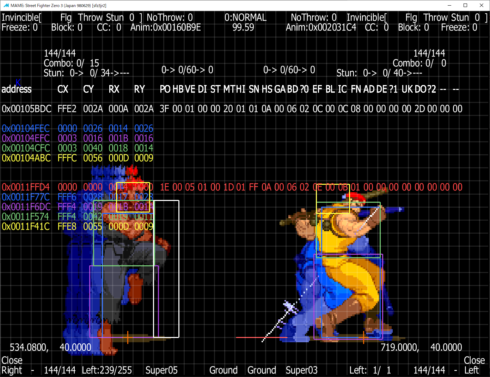 
　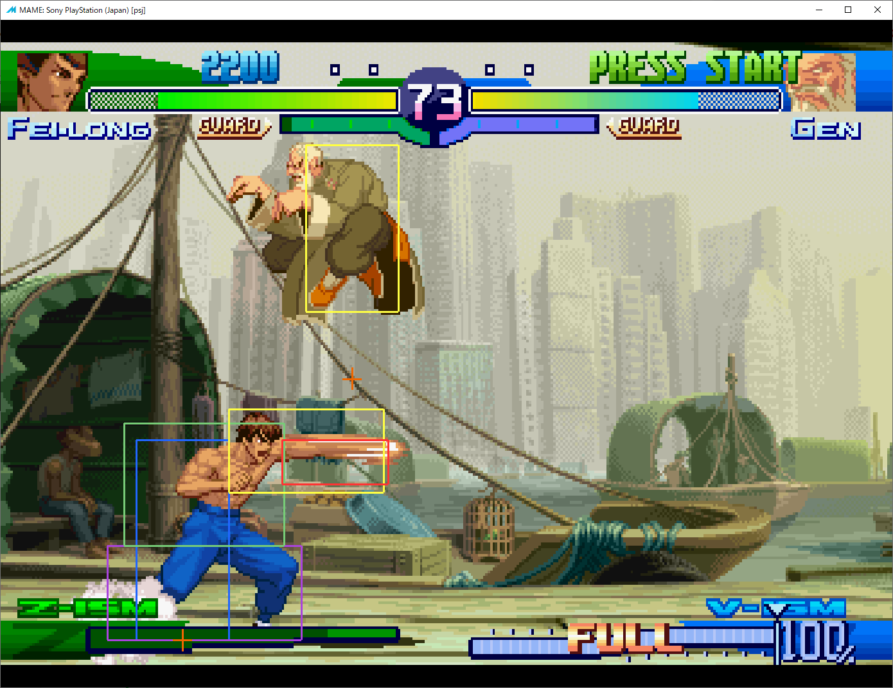 
　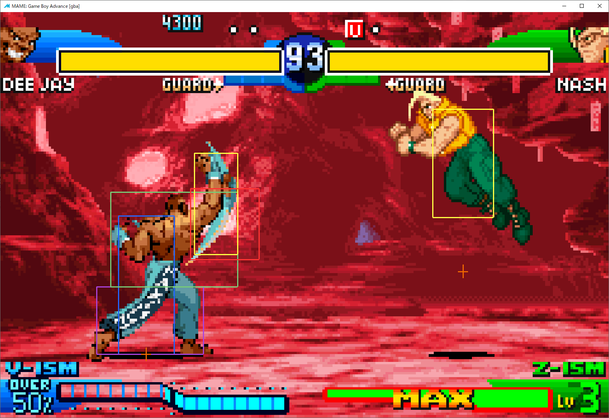 
 
・MAME Rerecording[mame-rr-0139-test2] 
　https://code.google.com/archive/p/mame-rr/ 
　CPS2版で利用可能。 
　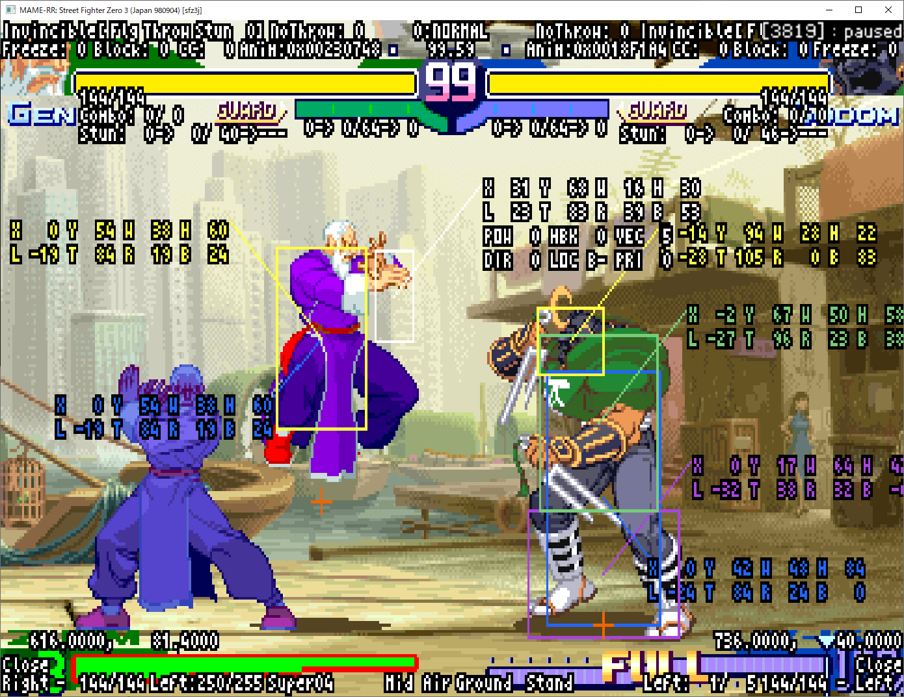 
 
・FinalBurn Alpha Rerecording[fba-rr-v007] 
　https://code.google.com/archive/p/fbarr/ 
　CPS2版で利用可能。 
　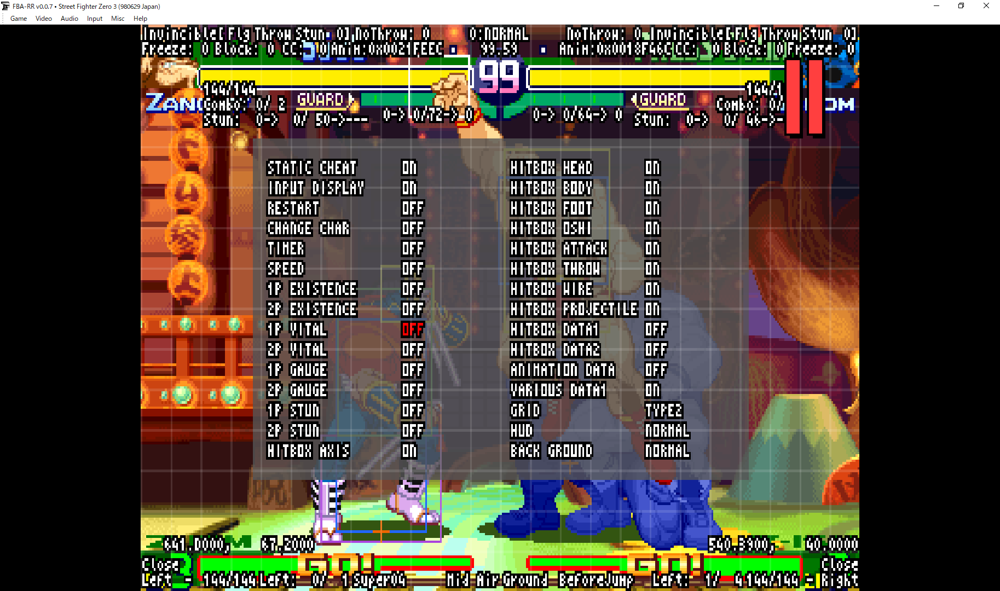 
 
・FightCade2[FBNeo v0.2.97.44-30] 
　https://www.fightcade.com/ 
　CPS2版で利用可能。 
　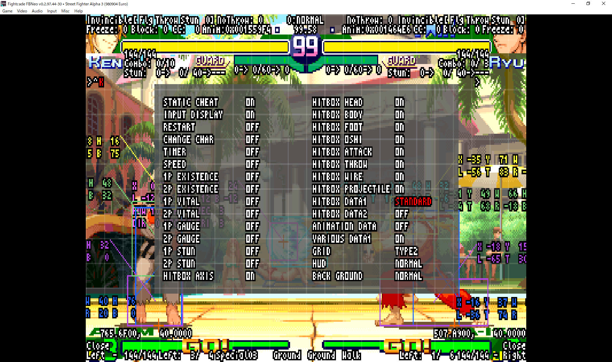 
 
・Bizhawk[BizHawk-2.4.2] 
　http://tasvideos.org/BizHawk.html 
　SS版、PS版、GBA版で利用可能。 
　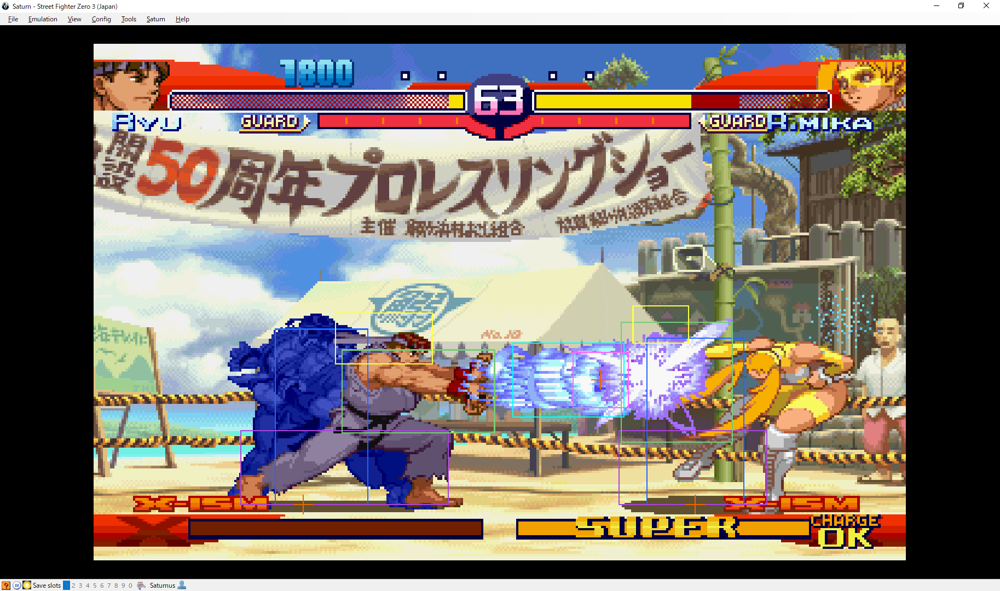 
　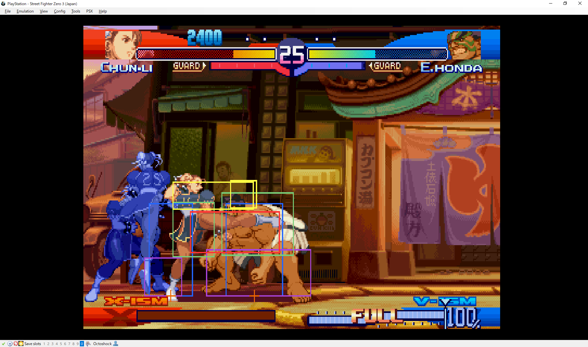 
　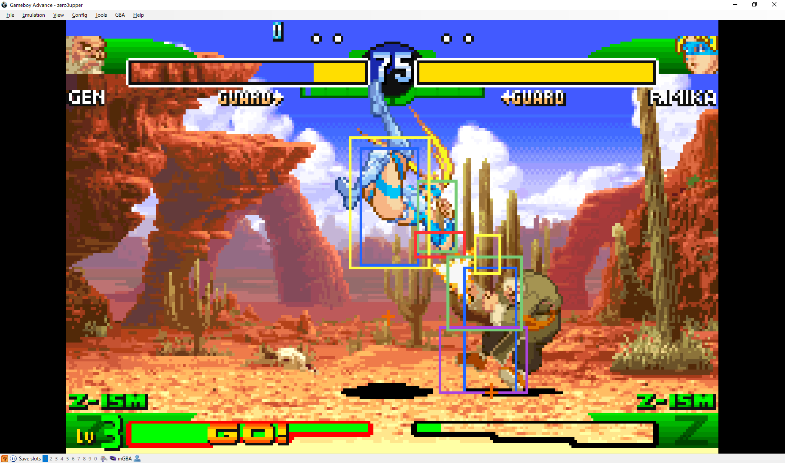 
 
・PSXjin[psxjinv2.0.2] 
　https://www.emutopia.com/index.php/emulators/item/299-sony-playstation/423-psxjin 
　PS版で利用可能。 
　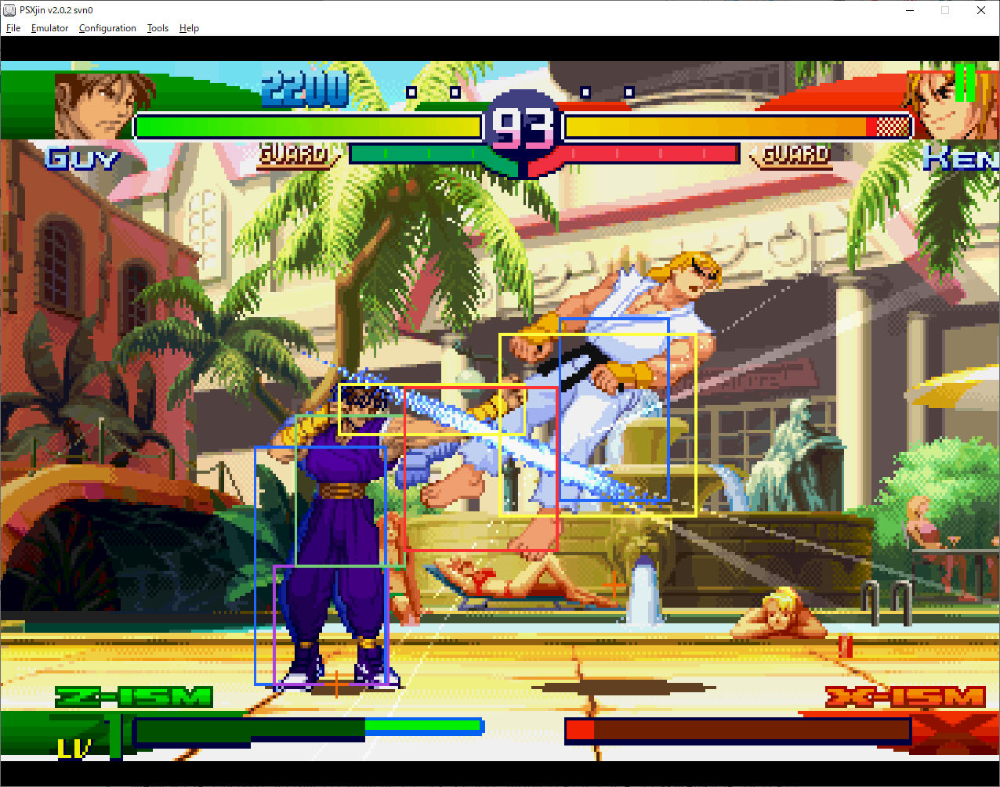 
 
・VBA-ReRecording[vba-rerecording-svn480-win32] 
　https://code.google.com/archive/p/vba-rerecording/ 
　GBA版で利用可能。 
　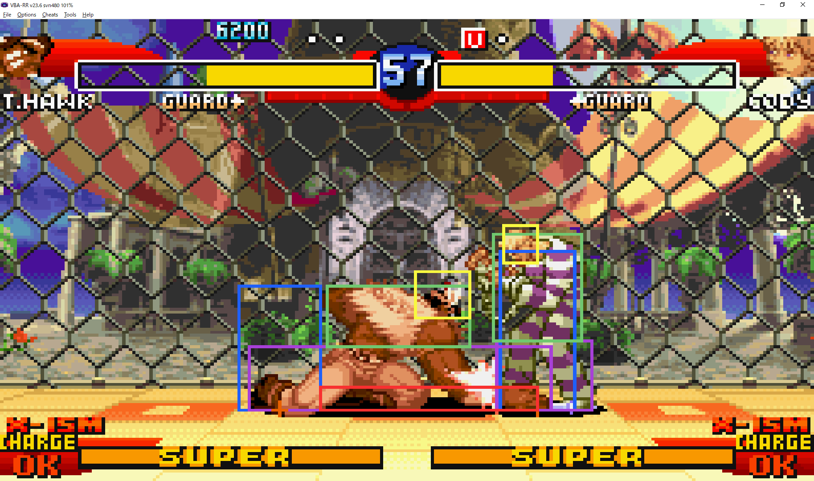 
 
・PCSX2-RR[PCSX2-rr_v1.0.1] 
　https://github.com/xTVaser/pcsx2-rr 
　PS2版で利用可能。 
　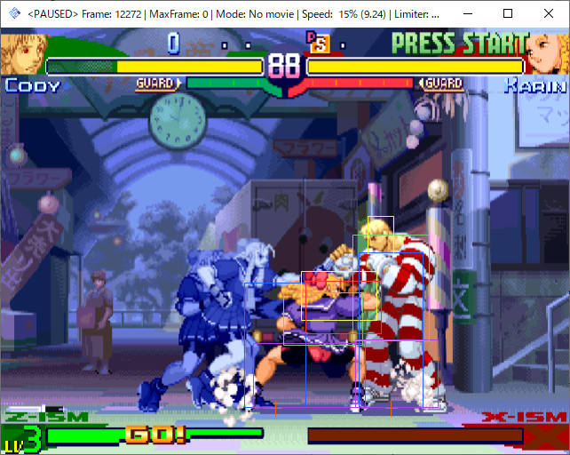 
 
 
【その他設定】 
・config.luaのcにて描画遅延設定や描画色の指定等を変更することが出来る。 
・program.luaのcheatにて、STATIC CHEATの設定を追加、変更することが出来る。 
 
 
【既知の不具合や仕様】 
・エミュレータによっては映像に対して表示される判定や値が同期されないことがある。推奨エミュレータはMAME。次いでMAME-RR。 
・MAME使用時に文字の幅がずれたり、画面端付近のデータ等が画面内に無理やり表示されたりする。 
　これはフォントにプロポーショナルフォントが使用されていたり、エミュレータの仕様によるもの。 
・Bizhawk＋SS版の環境にて、キャラIDの値が大きいキャラ(例：ユーニ)の攻撃判定が表示されない。また、動作が非常に重い。 
・一部のエミュレータや環境によっては投げ判定が表示されない。理由は技術的な問題やエミュレータの仕様など様々。 
　投げ判定を表示させるには複雑な処理が必要なため、特定の条件や設定を行わなければならず、敷居が高い。 
　とにかく表示させたいという場合はMAMEかMAME-RRにて980904の使用が簡単でおすすめ。980904はROMの作りが他と若干異なり簡単であるため。 
　解析者向け情報としてconfig.luaのcにてclear_idがtrueの場合、メモリの一部を書き換えて間借りすることによって投げ判定表示を実現している。 
　MAMEを使い、clear_idをfalse、debug_coopをtrueにした上で「-debug」を有効にするとメモリの書き換え無しに投げ判定表示が可能となる。 
　他にも様々な方法で投げ判定を表示させる手法を組み込んであるため、要望があれば詳しく解説するかもしれません。 
・etc...思い出したりしたら追記していきます。 
 
 
【修正履歴】 
v0.9 
・1st release
